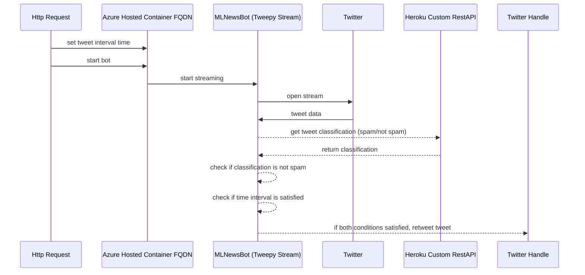

# MLNewsBot

This is an intelligent Twitter Bot that tracks ML related hashtags in real time and intelligently detects tweets that are not spam using NLP. It then posts reposts these tweets so its followers can have a useful source of ML/AI news and tips.
The NLP has been built into a REST API and deployed on Heroku for free public web hosting. The bot sends requests to the URL to classify tweets.
The bot has been Dockerized and deployed on Azure. Next steps include: 
1. Improving the NLP by performing an ML analysis with other models, such as fbprophet and LSTMs
2. Using ONNX to ensure model interoperability and optimize Azure hardware usage
3. Adding additional microservices
4. Creating an AKS (Kubernetes cluster) to better manage containers and scale the bot.  
The current event flow is shown below:

